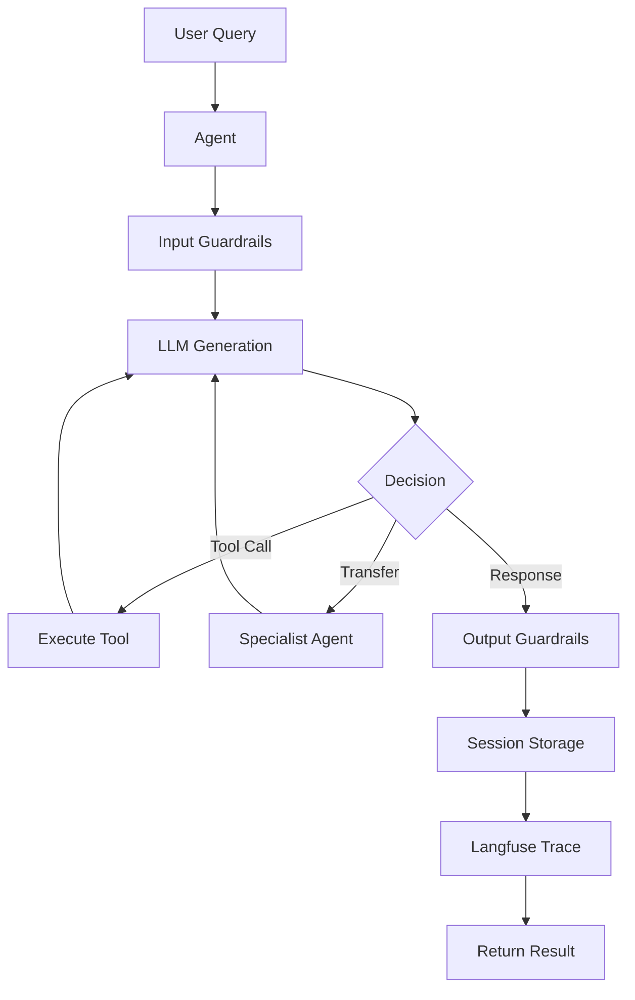

# Tawk Agents SDK - Documentation

> **v3.0.0** — Production-ready AI agent framework built on Vercel AI SDK v6

Welcome to the Tawk Agents SDK documentation. This guide covers everything from your first agent to enterprise-scale multi-agent systems.

---

## Quick Start

```typescript
import { Agent, run } from '@tawk.to/tawk-agents-sdk';
import { openai } from '@ai-sdk/openai';

const agent = new Agent({
  name: 'Assistant',
  model: openai('gpt-4o'),
  instructions: 'You are a helpful assistant.'
});

const result = await run(agent, 'Hello!');
console.log(result.finalOutput);
```

**Next Steps**: [Getting Started Guide](./getting-started/GETTING_STARTED.md)

---

## Documentation Hub

### Choose Your Path

| I want to... | Start here | Time |
|-------------|------------|------|
| **Get started quickly** | [Getting Started](./getting-started/GETTING_STARTED.md) | 15 min |
| **Test agents interactively** | [Interactive CLI](#interactive-cli) | 5 min |
| **Understand the system** | [Flow Diagrams](./reference/FLOW_DIAGRAMS.md) | 30 min |
| **Learn all features** | [Features Guide](./guides/FEATURES.md) | 30 min |
| **See the architecture** | [Complete Architecture](./reference/COMPLETE_ARCHITECTURE.md) | 60 min |
| **Build production system** | [Advanced Features](./guides/ADVANCED_FEATURES.md) | 45 min |
| **Check API details** | [API Reference](./reference/API.md) | Reference |

---

## Interactive CLI

Test agents interactively with real-time streaming, tool visualization, and multi-agent transfers:

```bash
npm run cli                                          # Default (openai:gpt-4o-mini)
npm run cli -- --model groq:llama-3.3-70b-versatile  # Groq
npm run cli -- --agent coder --verbose               # Coder preset
```

**Agent presets:** `default` (10 tools), `researcher`, `coder`, `multi-research` (multi-agent with transfers)

**Slash commands:** `/help`, `/agent <name>`, `/tools`, `/model <p:id>`, `/session`, `/history`, `/usage`, `/verbose`, `/clear`, `/quit`

---

## Learning Paths

### Path 1: New to the Framework (2 hours)

1. [Getting Started](./getting-started/GETTING_STARTED.md) - Install, first agent, tools
2. [Flow Diagrams](./reference/FLOW_DIAGRAMS.md) - Understand execution flows
3. [Features Guide](./guides/FEATURES.md) - Learn all features
4. Begin development

### Path 2: Experienced (1.5 hours)

1. [Flow Diagrams](./reference/FLOW_DIAGRAMS.md) - Visual understanding
2. [Complete Architecture](./reference/COMPLETE_ARCHITECTURE.md) - System design
3. [Advanced Features](./guides/ADVANCED_FEATURES.md) - Power features
4. Production deployment

---

## Complete Documentation Structure

### Getting Started (15 min)

**[Getting Started Guide](./getting-started/GETTING_STARTED.md)**
- Installation & setup
- Your first agent
- Basic tool calling
- Multi-agent basics

---

### Core Concepts (2 hours)

**[Core Concepts](./guides/CORE_CONCEPTS.md)** `20 min`
- What is an agent?
- True agentic architecture
- Tool execution model
- Agent lifecycle

**[Flow Diagrams](./reference/FLOW_DIAGRAMS.md)** `30 min`
- Basic agent execution
- Tool calling flow
- Multi-agent transfers
- Guardrails validation
- Langfuse tracing
- Session management
- Complete end-to-end flow

**[Complete Architecture](./reference/COMPLETE_ARCHITECTURE.md)** `60 min`
- System overview with 12+ diagrams
- Component relationships
- Directory structure
- Execution pipelines

---

### Feature Guides (3 hours)

**Essential Features:**

- **[Features Overview](./guides/FEATURES.md)** `30 min` - All features at a glance
- **[Advanced Features](./guides/ADVANCED_FEATURES.md)** `45 min` - Message helpers, lifecycle hooks, RunState management

**Specialized Features:**

- **[Agentic RAG](./guides/AGENTIC_RAG.md)** `30 min` - RAG with Pinecone, multi-agent RAG patterns
- **[Human-in-the-Loop](./guides/HUMAN_IN_THE_LOOP.md)** `20 min` - Approval workflows
- **[Tracing & Observability](./guides/TRACING.md)** `15 min` - Langfuse integration
- **[Error Handling](./guides/ERROR_HANDLING.md)** `15 min` - Error patterns, recovery
- **[Lifecycle Hooks](./guides/LIFECYCLE_HOOKS.md)** `15 min` - Event system
- **[TOON Optimization](./guides/TOON_OPTIMIZATION.md)** `15 min` - Token reduction

---

### Technical Reference

**[API Reference](./reference/API.md)** - Complete API documentation, type definitions

**[Performance Guide](./reference/PERFORMANCE.md)** `30 min` - Optimization strategies, benchmarks

---

## System Architecture



**[See detailed flow diagrams](./reference/FLOW_DIAGRAMS.md)**

---

### SDK Structure

```
tawk-agents-sdk/
├── bin/                   # Interactive CLI (tawk-cli)
│   ├── tawk-cli.ts       # Entry point
│   └── cli/              # REPL, renderer, tools, agents, commands
├── src/
│   ├── core/             # Core agent system
│   │   ├── agent/        # Agent class, run(), tool(), types
│   │   ├── runner.ts     # AgenticRunner — main execution engine
│   │   ├── execution.ts  # Parallel tool execution, step management
│   │   ├── transfers.ts  # Multi-agent transfer system
│   │   ├── runstate.ts   # Mutable execution state
│   │   └── usage.ts      # Token tracking and cost estimation
│   ├── guardrails/       # 10 validators (length, PII, content-safety, etc.)
│   ├── sessions/         # Memory, Redis, MongoDB, Hybrid sessions
│   ├── lifecycle/        # Event hooks + Langfuse integration
│   ├── tracing/          # AsyncLocalStorage-based trace context
│   ├── helpers/          # Message builders, safe-execute, safe-fetch, sanitize
│   ├── tools/            # Audio, embeddings, image, RAG, rerank, video tools
│   ├── mcp/              # Model Context Protocol integration
│   └── index.ts          # Barrel exports
├── examples/             # Example agents
├── tests/                # 197 unit tests (12 suites)
└── docs/                 # This documentation
```

---

## Key Features

### Core Features

| Feature | Description | Guide |
|---------|-------------|-------|
| **Agents** | Autonomous AI agents with tools | [Getting Started](./getting-started/GETTING_STARTED.md) |
| **Multi-Agent** | Coordinator + specialist pattern | [Flow Diagrams](./reference/FLOW_DIAGRAMS.md#3-multi-agent-transfer-flow) |
| **Tools** | Parallel execution, safe wrapper | [Features](./guides/FEATURES.md#tools) |
| **Guardrails** | Input/output validation, 10 types | [Flow Diagrams](./reference/FLOW_DIAGRAMS.md#4-guardrails-validation-flow) |
| **Tracing** | Complete Langfuse observability | [Tracing Guide](./guides/TRACING.md) |
| **Sessions** | Persistent conversation history | [Flow Diagrams](./reference/FLOW_DIAGRAMS.md#6-session-management-flow) |
| **CLI** | Interactive REPL for testing | [Interactive CLI](#interactive-cli) |

### Advanced Features

| Feature | Description | Guide |
|---------|-------------|-------|
| **Transfers** | Context-isolated agent transfers | [Advanced](./guides/ADVANCED_FEATURES.md) |
| **HITL** | Human-in-the-loop approvals | [HITL Guide](./guides/HUMAN_IN_THE_LOOP.md) |
| **Streaming** | Real-time response streaming | [API Reference](./reference/API.md) |
| **RAG** | Agentic RAG with Pinecone | [RAG Guide](./guides/AGENTIC_RAG.md) |
| **Hooks** | Lifecycle event system | [Hooks Guide](./guides/LIFECYCLE_HOOKS.md) |
| **TOON** | Token optimization | [TOON Guide](./guides/TOON_OPTIMIZATION.md) |

---

## Quick Examples

### Basic Agent

```typescript
import { Agent, run } from '@tawk.to/tawk-agents-sdk';
import { openai } from '@ai-sdk/openai';

const agent = new Agent({
  name: 'Assistant',
  model: openai('gpt-4o'),
  instructions: 'You are helpful.'
});

const result = await run(agent, 'Hello!');
```

### Agent with Tools

```typescript
import { Agent, run, tool } from '@tawk.to/tawk-agents-sdk';
import { z } from 'zod';

const calculator = tool({
  description: 'Do math',
  inputSchema: z.object({
    a: z.number(),
    b: z.number()
  }),
  execute: async ({ a, b }) => a + b
});

const agent = new Agent({
  name: 'Math',
  model: openai('gpt-4o'),
  tools: { calculator }
});

const result = await run(agent, 'What is 5 + 3?');
```

### Multi-Agent System

```typescript
const specialist = new Agent({
  name: 'Specialist',
  model: openai('gpt-4o'),
  instructions: 'You specialize in data analysis.'
});

const coordinator = new Agent({
  name: 'Coordinator',
  model: openai('gpt-4o'),
  instructions: 'Route tasks to specialists.',
  subagents: [specialist]  // Auto-creates transfer tools
});

const result = await run(coordinator, 'Analyze sales data');
```

### With Guardrails

```typescript
import { lengthGuardrail, piiDetectionGuardrail } from '@tawk.to/tawk-agents-sdk';

const agent = new Agent({
  name: 'Safe',
  model: openai('gpt-4o'),
  guardrails: [
    lengthGuardrail({ type: 'output', maxLength: 500 }),
    piiDetectionGuardrail({ type: 'output', block: true })
  ]
});
```

### With Tracing

```typescript
import { initLangfuse, Agent, run } from '@tawk.to/tawk-agents-sdk';

initLangfuse(); // Reads LANGFUSE_* env vars

const agent = new Agent({ /* ... */ });
const result = await run(agent, 'Query');
// Automatically traced to Langfuse
```

### With Sessions

```typescript
import { MemorySession } from '@tawk.to/tawk-agents-sdk';

const session = new MemorySession('user-123', 50);

const result1 = await run(agent, 'My name is Alice', { session });
const result2 = await run(agent, 'What is my name?', { session });
// Agent maintains context: "Your name is Alice"
```

---

## Status

| Metric | Status |
|--------|--------|
| **Build** | Passing |
| **Lint** | Zero errors |
| **Tests** | 197 passing (12 suites) |
| **Type Safety** | TypeScript strict mode |
| **AI SDK** | v6 (`ai@^6.0.0`) |

---

## Documentation Index

### By Time Available

**15 minutes:** [Getting Started](./getting-started/GETTING_STARTED.md), [Tracing Guide](./guides/TRACING.md), [Error Handling](./guides/ERROR_HANDLING.md)

**30 minutes:** [Flow Diagrams](./reference/FLOW_DIAGRAMS.md), [Features Guide](./guides/FEATURES.md), [RAG Guide](./guides/AGENTIC_RAG.md)

**1 hour:** [Complete Architecture](./reference/COMPLETE_ARCHITECTURE.md), [Advanced Features](./guides/ADVANCED_FEATURES.md)

### By Feature

| Looking for... | Document |
|---------------|----------|
| **Installation** | [Getting Started](./getting-started/GETTING_STARTED.md) |
| **Interactive testing** | [Interactive CLI](#interactive-cli) |
| **Flow understanding** | [Flow Diagrams](./reference/FLOW_DIAGRAMS.md) |
| **Architecture** | [Complete Architecture](./reference/COMPLETE_ARCHITECTURE.md) |
| **API details** | [API Reference](./reference/API.md) |
| **Multi-agent** | [Flow Diagrams #3](./reference/FLOW_DIAGRAMS.md#3-multi-agent-transfer-flow) |
| **Guardrails** | [Flow Diagrams #4](./reference/FLOW_DIAGRAMS.md#4-guardrails-validation-flow) |
| **Tracing** | [Tracing Guide](./guides/TRACING.md) |
| **Sessions** | [Flow Diagrams #6](./reference/FLOW_DIAGRAMS.md#6-session-management-flow) |
| **RAG** | [RAG Guide](./guides/AGENTIC_RAG.md) |
| **HITL** | [HITL Guide](./guides/HUMAN_IN_THE_LOOP.md) |
| **Performance** | [Performance Guide](./reference/PERFORMANCE.md) |

---

## Need Help?

- Check [Flow Diagrams](./reference/FLOW_DIAGRAMS.md) for visual explanations
- Review [Complete Architecture](./reference/COMPLETE_ARCHITECTURE.md)
- See [API Reference](./reference/API.md)
- [Open an issue](https://github.com/Manoj-tawk/tawk-agents-sdk/issues)

---

**Start building: [Getting Started](./getting-started/GETTING_STARTED.md)**
