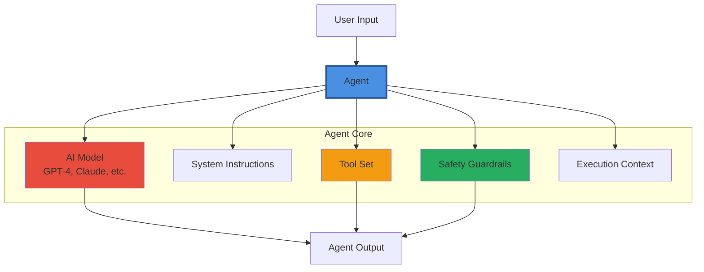
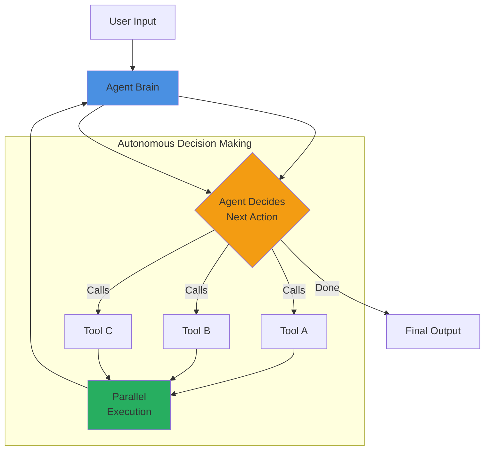
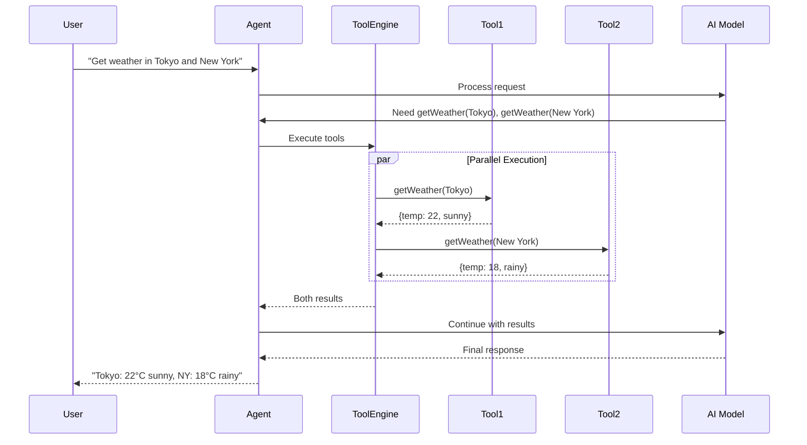
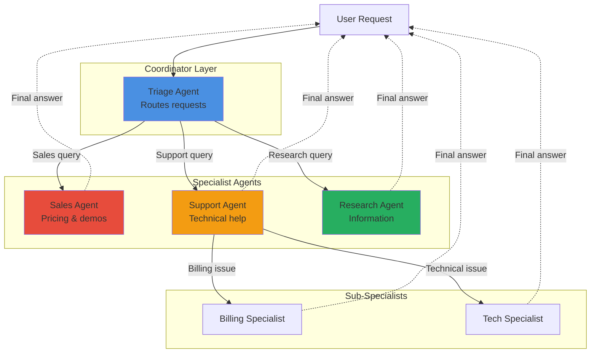
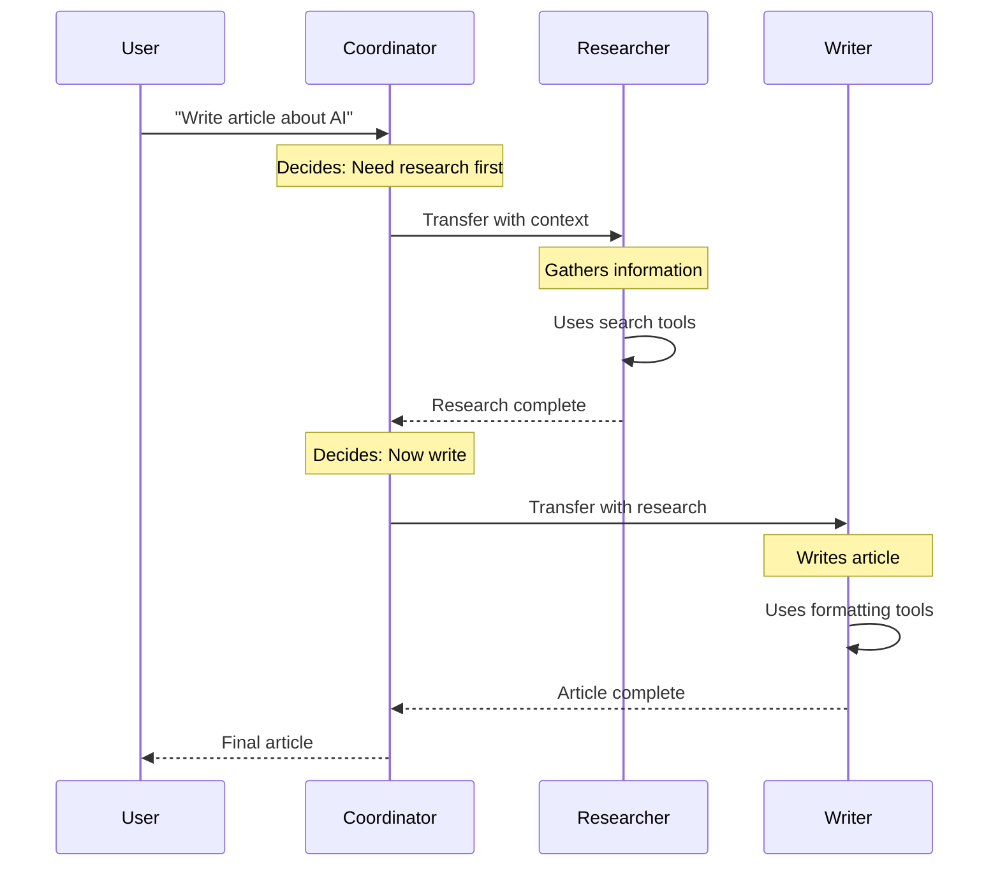
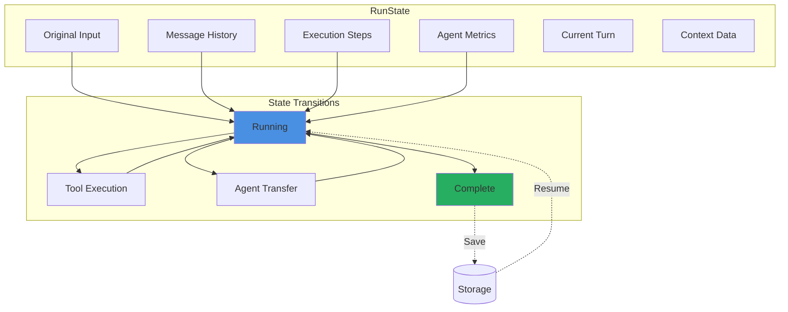
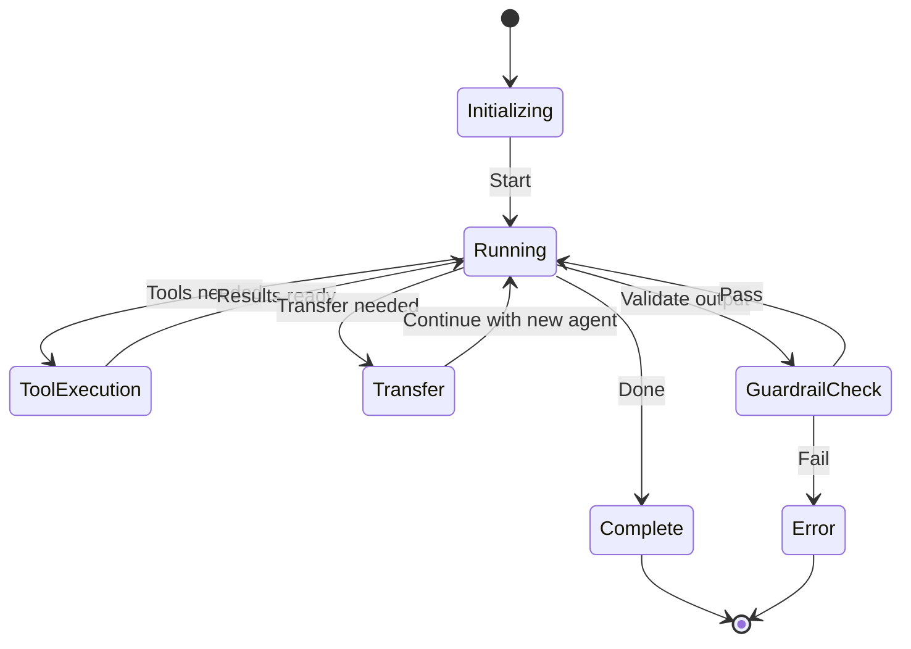
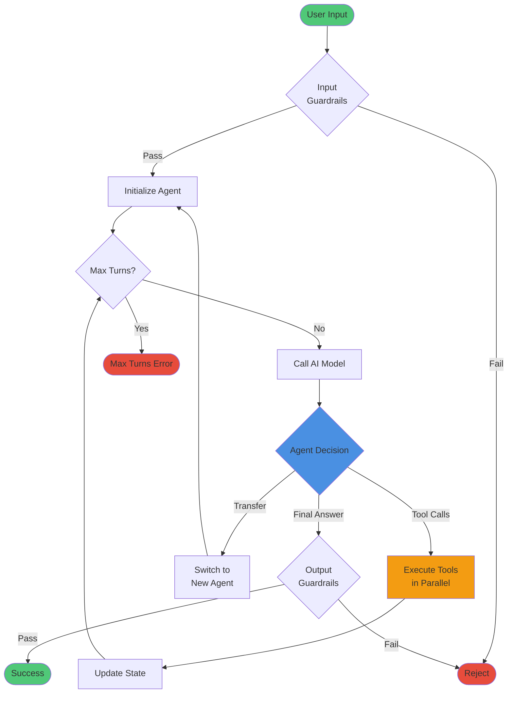
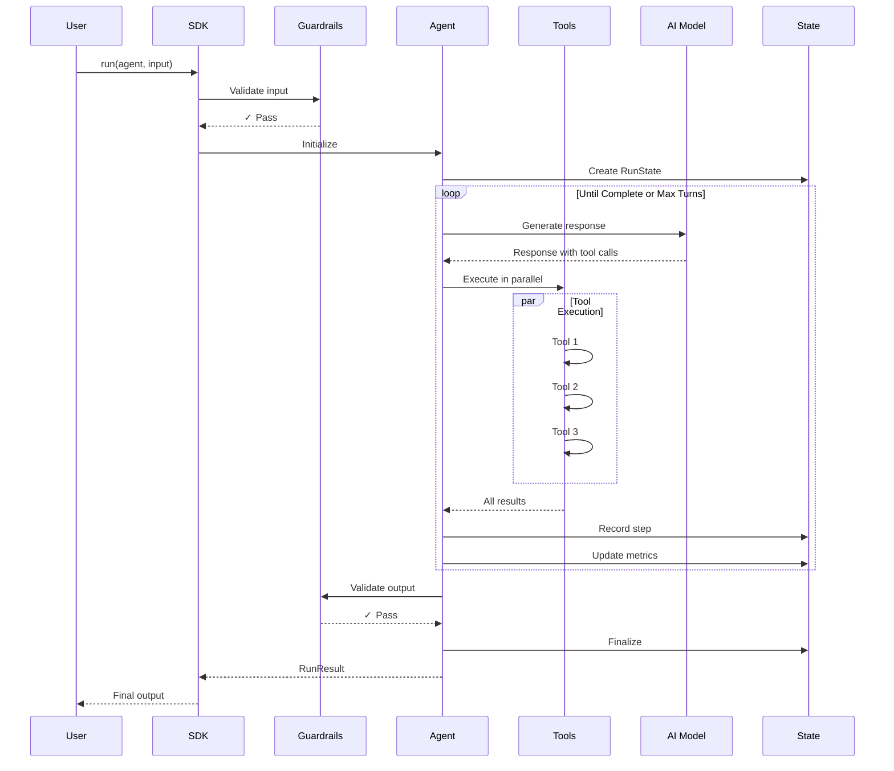

# 🎓 Core Concepts

**Understanding the fundamentals of Tawk Agents SDK**

This guide explains the core architecture and concepts that power the SDK. By the end, you'll understand how agents work, how they execute tools, and how to build complex systems.

---

## 📖 Table of Contents

1. [What is an Agent?](#what-is-an-agent)
2. [True Agentic Architecture](#true-agentic-architecture)
3. [Tool Execution](#tool-execution)
4. [Multi-Agent Systems](#multi-agent-systems)
5. [State Management](#state-management)
6. [Execution Lifecycle](#execution-lifecycle)

---

## 1. What is an Agent?

### Definition

An **Agent** is an autonomous AI entity with:
- **Intelligence**: Powered by LLMs (GPT-4, Claude, etc.)
- **Tools**: Functions it can call to take actions
- **Instructions**: System prompts defining its behavior
- **Context**: Access to application state and data
- **Safety**: Guardrails for validation and control

### Architecture Diagram



### Basic Example

```typescript
import { Agent, run, tool } from '@tawk.to/tawk-agents-sdk';
import { openai } from '@ai-sdk/openai';
import { z } from 'zod';

// Define a tool
const calculator = tool({
  description: 'Perform math calculations',
  inputSchema: z.object({
    expression: z.string().describe('Math expression')
  }),
  execute: async ({ expression }) => {
    return { result: eval(expression) };
  }
});

// Create an agent
const agent = new Agent({
  name: 'MathAgent',
  model: openai('gpt-4o'),
  instructions: 'You are a math tutor. Use the calculator tool for calculations.',
  tools: {
    calculate: calculator
  }
});

// Run the agent
const result = await run(agent, 'What is 15 * 23?');
console.log(result.finalOutput); // "15 * 23 equals 345"
```

---

## 2. True Agentic Architecture

### Core Principles

The Tawk Agents SDK is built on agentic principles where agents autonomously make decisions:



### Key Characteristics

- **Agent-Driven**: Agent autonomously decides what to do next based on context
- **Parallel Execution**: Tools run simultaneously for maximum efficiency
- **Dynamic Adaptation**: Behavior adapts based on results and state
- **Autonomous Flow**: No predefined paths - agent chooses its journey


| Feature | Agentic Implementation |
|---------|------------------------|
| **Decision Making** | AI-driven and context-aware |
| **Tool Execution** | Parallel by default |
| **Flexibility** | Dynamic adaptation |
| **State** | Complex RunState tracking |
| **Transfers** | Autonomous delegation |

---

## 3. Tool Execution

### Tool Lifecycle



### Tool Definition

```typescript
const myTool = tool({
  description: 'What the tool does',
  inputSchema: z.object({
    param: z.string()
  }),
  execute: async ({ param }, context) => {
    // Access context
    const userId = context.context.userId;
    const db = context.context.db;
    
    // Do work
    const data = await db.query('SELECT * FROM table WHERE id = ?', [userId]);
    
    return data;
  },
  
  // Optional: Enable/disable based on context
  enabled: (context) => context.context.isAdmin
});
```

### Parallel Execution

**Automatic Parallelization**:

```typescript
// Agent automatically parallelizes these
await run(agent, 'Get weather in Tokyo, London, and New York');

// Execution flow:
// 1. Agent calls all 3 getWeather tools simultaneously
// 2. All execute in parallel (fastest possible)
// 3. Agent receives all results at once
// 4. Agent synthesizes final response
```

**Performance Gain**:

```mermaid
gantt
    title Tool Execution Timeline
    dateFormat X
    axisFormat %L ms
    
    section Parallel Execution
    Tool 1 :0, 500
    Tool 2 :0, 500
    Tool 3 :0, 500
```


**Result**: All 3 tools complete in ~500ms through parallel execution

**Performance Benefit**: Up to 3x faster compared to serial execution

---

## 4. Multi-Agent Systems

### Agent Transfers

**Architecture**:



### Transfer Flow



### Implementation

```typescript
// Specialist agents
const researcher = new Agent({
  name: 'Researcher',
  model: openai('gpt-4o'),
  instructions: 'You research topics thoroughly.',
  transferDescription: 'Use for research tasks',
  tools: { search, fetchData }
});

const writer = new Agent({
  name: 'Writer',
  model: openai('gpt-4o'),
  instructions: 'You write clear, engaging content.',
  transferDescription: 'Use for writing tasks',
  tools: { format, spellCheck }
});

// Coordinator
const coordinator = new Agent({
  name: 'Coordinator',
  model: openai('gpt-4o'),
  instructions: 'Route tasks to specialists.',
  subagents: [researcher, writer]  // Available specialists
});

// Agent autonomously decides transfer chain
const result = await run(coordinator, 'Write an article about quantum computing');
// Flow: Coordinator → Researcher → Writer → Final output
```

---

## 5. State Management

### RunState Architecture



### Interruption & Resumption

```typescript
// Initial run
const result1 = await run(agent, 'Start complex task');

// Save state if needed for continuation
if (result1.state) {
  await saveToDatabase(result1.state);

  // ... later, resume from saved state ...

  const savedState = await loadFromDatabase();
  const result2 = await run(agent, savedState);

  console.log('Continued:', result2.finalOutput);
}
```

### State Transitions



---

## 6. Execution Lifecycle

### Complete Agent Execution



### Detailed Step-by-Step



### Lifecycle Hooks

```typescript
import { Agent } from '@tawk.to/tawk-agents-sdk';

// Agent extends AgentHooks (EventEmitter), so use .on() directly
const agent = new Agent({ /* config */ });

agent.on('agent_start', (context, agent) => {
  console.log('Agent starting');
});

agent.on('agent_tool_start', (context, tool) => {
  console.log(`Calling: ${tool.name}`);
});

agent.on('agent_tool_end', (context, tool, result) => {
  console.log(`Result: ${tool.name}`);
});

agent.on('agent_handoff', (context, nextAgent) => {
  console.log(`Handoff → ${nextAgent.name}`);
});

agent.on('agent_end', (context, output) => {
  console.log('Complete');
});
```

---

## 🎯 Key Takeaways

### 1. Agents are Autonomous
- They make decisions based on AI intelligence
- No predefined execution paths
- Dynamic adaptation to context

### 2. Parallel Execution is Default
- Tools execute simultaneously when possible
- Massive performance improvement
- No special configuration needed

### 3. State is First-Class
- Full state management with RunState
- State can be saved and resumed across calls
- Perfect for multi-step workflows

### 4. Multi-Agent is Native
- Agents can transfer to specialists
- Automatic context passing
- Seamless coordination

### 5. Safety is Built-In
- Guardrails at input and output
- Context-based tool enabling
- 9 built-in guardrail types

---

## 📚 Next Steps

Now that you understand the core concepts:

1. **Practice**: Try the [Getting Started Guide](../getting-started/GETTING_STARTED.md)
2. **Explore**: Read the [Features Guide](./FEATURES.md)
3. **Deep Dive**: Study the [Architecture](../reference/COMPLETE_ARCHITECTURE.md)
4. **Build**: Check out [Examples](../../examples)

---

## 🔗 Related Documentation

- [Features Guide](./FEATURES.md) - All features in detail
- [Architecture](../reference/COMPLETE_ARCHITECTURE.md) - Technical deep dive
- [API Reference](../reference/API.md) - Complete API docs
- [Advanced Features](./ADVANCED_FEATURES.md) - Power user features

---

**Ready to build?** → [Getting Started](../getting-started/GETTING_STARTED.md)

**Made with ❤️ by [Tawk.to](https://www.tawk.to)**
